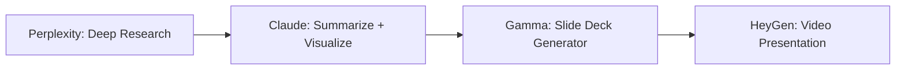

# Lecture 4. 
### 1. Introduction: Recap and What's Next

#### 1.1. Script
Welcome back, everyone, to our final lecture in the Basic AI Course—and congratulations for making it this far!

Over the last three sessions, we’ve taken quite a journey together.

In Lecture 1, we met the AI giants—ChatGPT, Claude, Perplexity, Gemini, and Mistral—and we also met their flaws. From biases to hallucinations, we learned to question AI rather than blindly trust it.

In Lecture 2, we flipped the lens—exploring real-life tasks where AI shines. We wrote essays, debugged code, translated idioms, and even analyzed visuals. We learned how to use the tools.

Then in Lecture 3, we peeked under the hood: exploring advanced UI features, reasoning chains, system prompts, and even multi-agent models.

Today is where it all comes together.
We’re going beyond the UI—into the backstage of AI systems:
- You’ll learn how to use LLM APIs to build and automate
- You’ll explore benchmarking and prompt precision techniques
- You’ll meet specialized AI tools like NotebookLM, Gamma, and HeyGen
- And we’ll discuss how to keep up with AI's rapid evolution

This lecture is your launchpad—so that you not only understand today’s tools but can adapt to tomorrow’s.

Let’s get started.
---

#### 1.2. Slide

**Slide Title: "Lecture 4: Expanding AI Horizons"**

- Left side: “Where We’ve Been”
	- Lecture 1: *AI Assistants & Limitations*
	- Lecture 2: *Text, Code, Visuals in Practice*
	- Lecture 3: *Advanced UI, Reasoning & Personalization*
- Right side: “Where We’re Going Today”
	- APIs & Prompt Precision
	- Benchmarking & LLM Arena
	- Specialized Tools (NotebookLM, Gamma, etc.)
	- Staying Updated

**Visuals**:
- Icons or simple illustrations for each domain: gears for API, trophy for benchmarking, puzzle pieces for integration, radar screen for staying current.

---

#### 1.3. Slide Notes

- **Tone Tip**: You’re guiding the class toward independence—highlight the *why* behind every tool and strategy today.
- **Fun Fact**: OpenAI’s Playground used to be text-only with no memory and limited formatting. Today, you can tweak temperature, set roleplay scenarios, and simulate product UIs in a browser.
- **Joke**: “In Lecture 1, AI hallucinated. In Lecture 2, it coded. In Lecture 3, it reasoned. Today? It becomes your lab assistant, graphic designer, video editor, and research analyst. All before lunch.”
- **Mention**:
	- [https://platform.openai.com/playground](https://platform.openai.com/playground)
	- [https://console.anthropic.com](https://console.anthropic.com)
	- [https://www.llmarena.com](https://www.llmarena.com)
	- [https://notebooklm.google](https://notebooklm.google)

---

#### 1.4. Demonstration (Optional Warm-Up)

**Title:** "How Precise is ChatGPT Today?"
**Prompt:**
```TeXt
Write an essay on the Titanic that is *exactly* 300 words. Do not present the answer until you’ve confirmed it meets the word count. If it’s not exact, revise and count again.

```
**Instructions**:
- Run in ChatGPT Pro or GPT-4o.
- If it overshoots, revise live to show the edit loop.
- Show how we can use `https://wordcounter.net/` to double-check results.

**Discussion Prompt**:
> "This might seem pedantic—but in technical writing, compliance, and academia, word count precision *matters*. How do you think AI performs when we force it to follow rigid constraints?"

### 2. Understanding APIs and LLM Integration

#### 2.1. Script
To really unlock the power of modern AI, we need to go beyond the chatbot interface and step into the world of APIs.
So what exactly is an API?
An API, or Application Programming Interface, is like a universal translator between your code and someone else’s service—in this case, a powerful AI model running on a remote server.
With just a few lines of code or even a no-code tool, you can:
- Send a prompt to GPT-4, Claude, Gemini, or Mistral
- Customize its behavior with parameters
- Get back structured data, completions, or summaries in seconds
This is what powers real-world applications—from customer service bots to automated legal summarizers to AI-powered dashboards.
Let’s look at the OpenAI Playground and Anthropic Console—these are visual front-ends for the APIs that let us tinker with models without writing any code.
We'll explore key parameters like:
- Temperature: controls randomness
- Max Tokens: caps the response length
- Top-p: narrows the sampling universe
- System prompts: secretly guide how the model behaves
Whether you're building a startup or a hobby project, understanding these controls is your first step toward AI integration mastery.
---

#### 2.2. Slide

**Slide Title: "LLM APIs: What They Are & Why They Matter"**

| Concept          | Explanation                                           | Real-World Use     |
| ---------------- | ----------------------------------------------------- | ------------------ |
| API              | Interface to access AI models programmatically        | Chatbots, apps     |
| Playground       | GUI tool to test prompts with OpenAI models           | Fast prototyping   |
| Console (Claude) | Similar testing ground for Anthropic models           | Prompt fine-tuning |
| Temperature      | Controls creativity/randomness (0 = strict, 1 = wild) | Writing vs. fact   |
| Max Tokens       | Limits response size                                  | Trimming outputs   |
| System Prompt    | Behind-the-scenes instruction                         | Role assignment    |

**Visuals:**
- Diagrams of API request/response flow
- Screenshots of OpenAI Playground and Claude Console
- Emoji thermometer next to "temperature" setting for humor

---

#### 2.3. Slide Notes

- **Tip**: Use metaphors — “The API is the waiter; your prompt is the order; the model is the chef.”
- **Trivia**: The first version of GPT-3 API launched in 2020 and had no memory, no chat history—just one-shot text completion.
- **Joke**: “Setting temperature to 1 is like giving your AI a Red Bull and telling it to be creative. Setting it to 0? You’ve got Spock.”
- Mention:
	- [OpenAI Playground](https://platform.openai.com/playground)
	- [Anthropic Console](https://console.anthropic.com)
	- [Google Vertex AI](https://cloud.google.com/vertex-ai)
- **Optional Visual Aid**: Draw or animate the “prompt in → response out” pipeline with labeled boxes.

---

#### 2.4. Demonstration

##### **Demo 1: Prompt Parameters in Action**

**Tool:** OpenAI Playground
**Prompt:**
```TeXt
Explain the difference between a black hole and a wormhole in simple terms.
```
**Instructions:**
- Run it with **temperature = 0** and **max tokens = 100**
- Then again with **temperature = 0.9** and **max tokens = 300**
- Compare responses side by side

**Talking Point:**  
> “Notice how the creative one adds metaphors and storytelling, while the low-temp one sticks to facts. This is useful when you're deciding whether you want **creativity or control**.”

---

##### **Demo 2: System Prompt Power (Claude Console)**

**System Prompt:**  
```TeXt
You are an overly dramatic science fiction writer.
```

**User Prompt:**
```TeXt
Describe the formation of a black hole.
```

**Instructions:**
- Run in Anthropic Console with Thinking Mode enabled
- Observe tone and “persona” shift based on system prompt

**Discussion Prompt:**  
> "If system prompts are like backstage instructions, how would you use this to shape a brand’s voice—or prevent hallucinations in high-risk use cases?"
---
### 3. Advanced Prompt Crafting Techniques

#### 3.1. Script
Welcome to the art and science of precision prompting.
Up until now, we’ve been writing prompts like casual messages to an assistant. But with the right techniques, prompts can become precise instructions—like code.
Why is this important?
Because the moment you rely on AI for structured outputs—whether for reports, essays, code, or data—you need control.
In this section, we’ll focus on three areas:
1. Word count mastery – how to make the model hit exact lengths, like 300 or 5000 words
2. Token awareness – how to think like the model by understanding its building blocks
3. Prompt wizardry – clever structures that force better reasoning or formatting

Let’s dive into some prompt magic that would make even Hogwarts jealous.
---

#### 3.2. Slide

**Slide Title: "Precision Prompting: When Words Matter"**

| Technique           | Description                                         | Use Case                        |
| ------------------- | --------------------------------------------------- | ------------------------------- |
| Word Budgeting      | Telling the model to write exactly N words          | Essays, compliance, SEO         |
| Token Awareness     | Understanding how models break down text            | Avoiding truncation             |
| Segmented Prompting | Breaking large tasks into chunks for better control | Long reports, code blocks       |
| Prompt Wizardry     | Embedding hidden logic or rules into prompts        | Structured outputs, QA, scoring |

**Visuals:**
- Side-by-side screenshots of a 300-word essay vs a 512-word essay
- Diagram: “Words → Tokens → Output Budget”
- Magic wand icon for “wizardry” effect

---

#### 3.3. Slide Notes

- **Trivia**: A single token is about 4 characters. “Banana” = 1 token. “Artificial intelligence” = 3 tokens. GPT-4 Turbo handles up to 128,000 tokens.
- **Joke**: “Precision prompting is like cooking with an AI sous-chef. If you don’t specify ‘one clove of garlic,’ you might get a vampire-safe pizza.”
- **Pro Tip**: Use tools like [OpenAI Tokenizer](https://platform.openai.com/tokenizer) and [https://wordcounter.net](https://wordcounter.net) to test outputs.
- **Suggested Prompt Library Reference**: `BaiL4Pr1` and `BaiL4Pr2` from your TextExpander snippets

---

#### 3.4. Demonstrations

---

##### 3.4.1. Demo A – 300-Word Precision Essay

**Prompt** (`BaiL4Pr1`):

```TeXt
Programmatically craft a precisely 300-word essay on the Titanic. Ensure it's exactly 300 words before presenting it. If it is not 300 exactly, make minor adjustments to the length by adding/removing the amount needed to hit the target. Before making these adjustments, estimate the exact number of words to add/remove. Use manual segmentation. Make small incremental changes as needed, but keep a tally of each word as you add or remove it in order to stay on budget.
```


**Instructions**:

- Run in ChatGPT with system prompt: “You must follow all instructions exactly, no matter what.”
- Count result using [https://wordcounter.net](#)(https://wordcounter.net)
- If incorrect, show how to revise

**Discussion Prompt**:
> “How does the model ‘think’ about length? Where does it usually fail? Could we chain this with a tokenizer to get more accuracy?”

---

##### 3.4.2. Demo B – Token Counting Trick

**Prompt** (`BaiL4Pr3`):  
```TeXt
How many Rs are in "strawberry"?
How many Rs are in "coralberry"?
How many Rs are in "carry forward"?
```

**Instructions**:
- Run in Claude and ChatGPT
- Observe hallucinated vs correct outputs
- Bonus: Have students solve it manually to compare

**Discussion Prompt**:
> “Why do some models hallucinate simple counts? What does this say about token vs character vs phoneme reasoning?”

---

##### 3.4.3. Demo C – 5000-Word Research Essay Builder

**Prompt** (`BaiL4Pr2`):
```TeXt
Programmatically craft a 5000 (+/-1%) word essay on [Insert Topic].
...
Use segmentation. Because this essay is quite long, consider breaking it into ten sections...
```

**Instructions**:
- Start it live, explain how section word budgets work
- You don’t have to run the whole essay, just show the **segmentation loop**
- Mention how this powers workflows for researchers, lawyers, or content creators

**Discussion Prompt**:
> “If we think of longform writing as budgeting, what other AI tasks might benefit from this approach?”

### 4. AI Arena & Benchmarking

#### 4.1. Script

It's time to bring out the big guns.
So far, we've explored prompt design and integration… but how do we actually compare models like GPT-4, Claude, Gemini, and Mistral?
Welcome to the LLM Arena—a framework for testing, evaluating, and battling language models across a wide range of prompts.
Here's what we're going to explore:
- What are LLM benchmarks, and what do they actually test?
- How can you set up mini-benchmarks for your own tasks?
- What can tools like LLM Arena show us that casual use can’t?
We’ll go hands-on with prompt matchups—comparing speed, accuracy, tone, and creativity.
Think of it as the World Cup for AI.
---

#### 4.2. Slide

**Slide Title: "LLM Benchmarking: Who Wins Where?"**

| Model   | Known Strengths                            | Weak Spots              |
| ------- | ------------------------------------------ | ----------------------- |
| GPT-4   | Reasoning, structure, multilingual support | Occasional overthinking |
| Claude  | Ethics, logic, long context                | Subtle formatting gaps  |
| Gemini  | Multimodal tasks, clean formatting         | Still maturing in logic |
| Mistral | Lightweight, local inference               | Lacks broader context   |

**Visuals:**
- Logos of GPT-4, Claude 3, Gemini, Mistral in corners
- Diagram showing different evaluation axes: creativity, reasoning, accuracy, verbosity
- Screenshot of [https://llmarena.com](https://llmarena.com)

---

#### 4.3. Slide Notes

- **Tip**: Use metaphors like sports leagues, where GPT-4 is a chess champion, Claude is the philosopher, Gemini is the multimedia artist, and Mistral is the indie underdog.
- **Joke**: “The only thing missing here is live commentary and dramatic theme music—but don’t tempt me.”
- Mention:
	- [https://llmarena.com](https://llmarena.com) for side-by-side model evaluations
	- Academic benchmark sets: MMLU, BigBench, ARC
	- Leaderboards (like LMSYS or HuggingFace) for up-to-date results

---

#### 4.4. Demonstrations

##### 4.4.1. Demo A – Real-Time Arena Test (Creative Output)
**Prompt**:
```TeXt
Describe the first contact between humans and an alien species in under 100 words. Include emotion, tension, and a twist.
```

**Instructions**:
- Run the prompt in GPT-4, Claude, Gemini, and Mistral (separately or using [https://chat.lmsys.org](#)(https://chat.lmsys.org) if available).
- Show all results side-by-side on screen

**Discussion Prompt**:
> “Which one made you *feel* something? Which was the most concise? Which one surprised you?”

---

##### 4.4.2. Demo B – Accuracy Challenge
**Prompt**:  
```TeXt
What are the three key provisions of the Universal Declaration of Human Rights?
```

**Instructions**:
- Run in all models
- Fact-check with [https://www.un.org/en/about-us/universal-declaration-of-human-rights](https://www.un.org/en/about-us/universal-declaration-of-human-rights)
- Look for hallucinations, vague responses, and citation attempts

**Discussion Prompt**:
> “Who got it right? Who played it safe? Who added fluff?”

---

##### 4.4.3. Demo C – Speed & Brevity Test
**Prompt**:
```TeXt
Explain blockchain to a 10-year-old in 2 sentences.
```

**Instructions**:
- Time each response (fun stopwatch moment)
- Note which model hit the tone and kept it short

**Discussion Prompt**:
> “If you had to put this in a school newsletter, which one would you use?”
---

##### 4.4.4. Bonus Mini-Challenge – Creative Rewrite

**Prompt**:  
```TeXt
Rewrite the nursery rhyme 'Jack and Jill' as a crime noir opening paragraph.
```

**Instructions**:
- Run in Claude and GPT-4o for fun comparison
- Read both aloud dramatically 😎

**Discussion Prompt**:
> “Which model has more style? Which felt more like a *genre* than a gimmick?”

### 5. Advanced AI-Enhanced Image Editing

#### 5.1. Script
Let’s take a break from text and look at the visual side of AI.
While most people associate image generation with tools like Midjourney or DALL·E, there's another powerful angle: image editing with AI using code.
One of the most versatile tools for this is the Pillow library—also known as PIL. It’s like Photoshop’s nerdy cousin: no fancy UI, but total control.
What’s exciting is that we can prompt ChatGPT to write Pillow scripts that apply filters, transformations, and artistic styles—without needing to touch Photoshop.
In this section, we’ll:
- Convert images to greyscale, pixelated, or sepia
- Add dramatic effects like vignettes and Ben-Day dots
- Try out some artistic transformations like oil painting or retro pixel art
You’ll see how generative AI can collaborate with code to unlock creativity in a whole new way.
---

#### 5.2. Slide

**Slide Title: "AI + Code = Visual Magic"**

| Technique    | Effect Example            | Use Case                 |
| ------------ | ------------------------- | ------------------------ |
| Greyscale    | Black-and-white with mood | Film look, stylization   |
| Vignette     | Darkened edges for drama  | Focus viewer attention   |
| Pixelation   | Retro aesthetic           | Game art, fun visuals    |
| Sepia        | Vintage tone              | Historical feel          |
| Band Merge   | Swap color channels       | Experimental art         |
| Oil Painting | Simulate brush strokes    | Artistic transformations |

**Visuals**:
- Grid of before-and-after images showing each effect
- Callout: “All edits generated using ChatGPT + Pillow (no Photoshop!)”

---

#### 5.3. Slide Notes

- **Fun Fact**: The Python Imaging Library (PIL) dates back to the 1990s. Pillow is its modern fork—and it works beautifully with AI-generated code.
- **Joke**: “It’s like having a moody digital intern with Photoshop skills and a Python habit.”
- **Tip**: Let students know they can use free tools like [Google Colab](https://colab.research.google.com/) or [Replit](https://replit.com/) to run Python + Pillow code even without setup.
- Mention:
	- `pip install pillow` for local setup
	- Link to Pillow’s official docs: [https://pillow.readthedocs.io](https://pillow.readthedocs.io)

---

#### 5.4. Demonstrations

---

##### 5.4.1. Demo A – Classic Image Edits (Greyscale + Vignette)

**Prompt to ChatGPT**:
```TeXt
Write Python Pillow code to take an uploaded image, convert it to greyscale, and add a soft vignette effect around the edges.
```

**Instructions**:

- Upload a test image (e.g., whiteboard photo or headshot)
- Copy-paste generated code into a Jupyter notebook or Replit
- Show original and edited versions side-by-side

**Discussion Prompt**:
> “What would it take to recreate this manually in Photoshop? How long did this take with AI + code?”

---

##### 5.4.2. Demo B – Ben-Day Dots / Comic Book Style

**Prompt** (`BaiL4Pr5`):  

```TeXt
Revise the image Ben-Day style, in big solid color dots. Retain the colors against a background of black.
```

**Instructions**:

- Run the code in Python
- Zoom into the result to show the dot pattern

**Bonus**: Print out a before/after and ask “Which one would you post on Instagram?”

---

##### 5.4.3. Demo C – Oil Painting & Pixel Art Mashup

**Prompt**:  

```TeXt
Apply an oil painting effect to the image using Pillow. Then pixelate the image to look like vintage Nintendo games.
```

**Instructions**:

- Explain that true oil-paint filters require plug-ins or deeper code (simulate with filters + smoothing)
- Show how AI can chain two effects in one script

**Discussion Prompt**:
> “Imagine chaining this with DALL·E image variation or Upscale tools. How far could we push generative design workflows?”

---

##### 5.4.4. Demo D – Remix and Band Merge

**Prompt**:  
```TeXt
Split the RGB bands of the image and merge them in a new order (e.g., BGR). Add a color overlay to accent one band.
```

**Instructions**:

- This is more experimental—show how you can create funky tints and neon-glitch effects
- Use a vibrant image with multiple colors

**Discussion Prompt**:
> “This feels like algorithmic art. Could we train AI to *learn* our favorite styles and automate full design cycles?”

---
Perfect — this is one of the most *hands-on* and surprising parts of the lecture. You're about to showcase tools that go way beyond ChatGPT and Claude. Let’s jump into:

---

### 6. Specialized AI Tools

#### 6.1. Script
So far, we’ve worked mostly with general-purpose LLMs. But now, let’s explore the specialized side of AI—tools that take the power of large models and apply them to specific tasks.

These tools aren’t just chatbots. They’re interactive research assistants, visual designers, presentation builders, and content curators.

Think of them like… domain-specific superpowers:
- Need to analyze a 30-page report? → Use NotebookLM
- Want to turn text into a clean slideshow? → Try Gamma
- Have a brainstorm to organize visually? → Call Napkin.ai
- Need to summarize a news article in Spanish? → Meet ReadPartner
- Want to make a realistic AI avatar video? → Say hi to HeyGen

You don’t need to know code to use any of them.
Let’s walk through each one and see how they can amplify your thinking.
---

#### 6.2. Slide

**Slide Title: "Specialized AI Tools: Your Creative Sidekicks"**

| Tool        | Superpower                                 | Use Case                       |
| ----------- | ------------------------------------------ | ------------------------------ |
| NotebookLM  | Reads, summarizes, and reasons with docs   | Reports, whitepapers, guides   |
| Gamma       | Turns text into presentations              | Pitch decks, explainer slides  |
| Napkin.ai   | Organizes your ideas visually              | Brainstorms, note clustering   |
| ReadPartner | Summarizes articles/videos (multi-lingual) | Learning, content research     |
| HeyGen      | Creates talking-head AI videos             | Explainers, marketing, avatars |

**Visuals:**
- Logos/screenshots of each tool in action
- Clean 2x3 layout with “use case” badges underneath

---

#### 6.3. Slide Notes

- **Tip**: Emphasize these are *low-barrier tools*. Most use drag & drop, uploads, or text boxes—*no code required*.
- **Joke**: “If ChatGPT is your generalist AI, these are like the weirdly talented friends who only do one thing—*but do it brilliantly*.”
- Mention:
	- [https://notebooklm.google](https://notebooklm.google)
	- [https://gamma.app](https://gamma.app)
	- [https://napkin.one](https://napkin.one)
	- [https://readpartner.com](https://readpartner.com)
	- [https://heygen.com](https://heygen.com)

---

#### 6.4. Demonstrations

##### 6.4.1. Demo A – **NotebookLM** (Q&A Over Documents)

**Demo Setup**:

- Upload a scientific paper or a PDF whitepaper
- Ask:
	```plaintext
	“What are the three key findings in this report?”
	“Explain the methodology used in Section 2.”
	“Generate a study guide for this document.”
	```

**Instructions**:

- Show how NotebookLM responds in real-time with citations and summaries
- Navigate between document and answer window

**Discussion Prompt**:
> “How might this replace old-school ‘Ctrl+F and skim’ workflows? What risks come from relying on AI for summaries?”

---

##### 6.4.2. Demo B – **Gamma** (AI Slide Deck Generator)

**Prompt**:
```plaintext
Create a presentation about the benefits of AI in education.
```

**Instructions**:

- Show how Gamma takes a paragraph and turns it into a clean, editable presentation
- Edit one slide live to demonstrate customization

**Bonus**: Paste your own text and watch Gamma turn it into slides *live*

**Discussion Prompt**:
> “Could this change how we build presentations in fast-paced work environments? When would you still need PowerPoint?”

---

##### 6.4.3. Demo C – **Napkin.ai** (Brainstorming Canvas)

**Demo Setup**:

- Create a simple idea cluster: "Launching a podcast"
- Input notes like:
	- “Name ideas: MicDrop, EarFuel, The Morning Loop”
	- “Need cover art, distribution, theme music”
	- “Weekly vs monthly schedule?”

**Instructions**:

- Show how Napkin visualizes and clusters notes dynamically
- Link related ideas and highlight emerging patterns

**Discussion Prompt**:
> “What kinds of work—creative, strategic, personal—would benefit from this kind of thinking canvas?”

---

##### 6.4.4. Demo D – **ReadPartner** (Live Summarization)

**Demo Options**:
- Summarize a YouTube video
- Translate a news article into Spanish and summarize

**Prompt Example**:  
```plaintext
Summarize this article in 200 words and translate it into Spanish.
```

**Instructions**:

- Use the browser extension or upload via link
- Highlight output’s clarity and multilingual capability

**Discussion Prompt**:
> “Where would multilingual summarization help you in real life? Journalism? Learning? Travel?”

---

##### 6.4.5. Demo E – **HeyGen** (Talking AI Avatars)

**Demo Setup**:

- Use the free HeyGen version or pre-generated clip
- Upload script:
	```plaintext
	Welcome to our AI tools showcase. I'm your digital assistant, and today we'll explore five tools that turn your ideas into action.
	```

**Instructions**:

- Show avatar lip-syncing and tone delivery
- Point out avatar customization features

**Discussion Prompt**:
> “Where could you *actually* use this? Internal company training? YouTube intros? Personalized customer service?”

---
Excellent — this is where everything you've shown *starts to click* for the learners. You're not just introducing tools anymore; you're showing how to orchestrate them like an AI-powered symphony. Let's dive in:

---

### 7. Combining Tools for Extraordinary Results

#### 7.1. Script
Okay, we’ve explored some amazing individual tools—but what happens when we combine them?

This is where real transformation begins. When you link research, analysis, visualization, and presentation tools together, you create something greater than the sum of its parts: a workflow powered by AI.

Think of it like an assembly line of brilliance:

Research with Perplexity

Visualize with Claude or NotebookLM

Present with Gamma

In this section, I’ll walk you through a real-world example—building a strategic industry report using multiple AI tools in a smooth pipeline.

This isn’t just faster—it’s smarter, more scalable, and adaptable for your job, business, or creative work.

Let’s see what that looks like in action.
---

#### 7.2. Slide

**Slide Title: "Cross-Platform Workflows = Superhuman Output"**

**Workflow Visualization:**



**Callout Examples:**
- “10,000-word industry report in 90 minutes”
- “Investor pitch deck from a PDF + 3 prompts”
- “Client onboarding videos generated overnight”

**Visuals:**
- Icons/logos of each tool arranged in a pipeline
- Arrow flow showing data moving from one to the next

---

#### 7.3. Slide Notes

- **Analogy**: This is like chaining LEGO bricks—each tool has a *shape* that fits perfectly into the next if you know how to use it.
- **Joke**: “Suddenly your Sunday project turns into a boardroom-ready report—with animations.”
- **Mention**:
	- Medium article inspiration: [The 4-Step Framework to Create Research Reports in Minutes with AI](https://medium.com/publishous/the-4-step-framework-to-create-powerful-research-reports-in-minutes-with-ai-516913559fc8)

---

#### 7.4. Demonstration

##### 7.4.1. Demo – Electric Vehicle Outlook Report (2030)

---

**Step 1 – Research in Perplexity**

**Prompt**:  

```mermaid
Find Electric vehicle industry outlook reports for 2030 globally. Focus on:
- Market trends
- Consumer spending
- Technologies
- Growth forecasts
Use site:deloitte.com OR site:mckinsey.com filetype:pdf
```

- Show link previews, export as citations
- Copy key insights

---

**Step 2 – Visualization in Claude (or NotebookLM)**

**Claude Project Setup:**

- Paste research summary and prompt:
```mermaid
Create 3 charts:
- Global EV adoption trends (2015–2030)
- Charging infrastructure by country
- Consumer interest vs battery range
```

- Specify corporate palette: Deep Blue, Silver Grey
- Claude generates visuals + short executive summaries

---

**Step 3 – Presentation in Gamma**

**Prompt**:
```mermaid
Create a 10-slide boardroom presentation titled “EV Market Trends Through 2030,” based on the following summary + charts.
```

- Paste content from Claude
- Gamma formats it with animations and clean layout

---

**Step 4 – Optional: Narrated Video in HeyGen**

**Script**:  
```mermaid
This is the Electric Vehicle Industry Outlook Report. Over the next decade, we expect EV adoption to reach 40% globally...
```

- Show how text becomes a narrated avatar video for pitch distribution

---

#### 7.5. Discussion Prompt

> “How could you apply this approach to your work? Think reports, training, newsletters, strategic briefs. Where would AI pipelines save you the most time—or unlock something you didn’t think was possible?”

---
Here we go — Section 8 is all about *depth*. This is your “go big or go home” moment, showing how students can use AI to generate **longform, structured, expert-level research** — with a tight budget and no team of interns.

---

### 8. Deep Research Techniques on a Budget

#### 8.1. Script
Let’s say you need to produce a 10,000-word report on a complex topic.
Traditionally, this would take a research assistant a week or two, maybe more.
But with the right prompts and workflows, AI can generate detailed, well-organized longform content that is surprisingly coherent and structured — if you guide it correctly.
In this section, we’ll focus on using tools like Perplexity, Claude, and even ChatGPT to:
- Find reliable, cited information
- Structure long documents with academic formatting
- Respect word budgets and adjust dynamically
- Incorporate planning, reflection, and correction loops

And yes — we’ll even attempt a 10,000-word research draft.
This isn’t just about speed. It’s about accuracy, structure, and credibility without expensive subscriptions or massive tool stacks.
---

#### 8.2. Slide

**Slide Title: "Longform AI Research: Big Output, Low Budget"**

| Strategy              | Description                                  | Tool            |
| --------------------- | -------------------------------------------- | --------------- |
| Structured Prompting  | Break report into sections & subsections     | Claude, GPT-4   |
| Real-time sourcing    | Gather facts + citations from the web        | Perplexity      |
| Planning + Adjustment | Dynamic word budget & segment control        | GPT-4 / Claude  |
| Markdown Formatting   | Clean outputs with headers, links, structure | Claude, ChatGPT |

**Visuals:**
- Word counter hitting 10,000 like a speedometer
- Outline-style document structure with markdown headers

---

#### 8.3. Slide Notes

- **Tip**: This is where word count prompts (`BaiL4Pr2`) shine — students see prompt engineering turn into production workflows.
- **Joke**: “It’s like writing a thesis with caffeine, but the caffeine is GPT-4.”
- Mention:
	- [https://wordcounter.net](https://wordcounter.net)
	- Claude for document structure & markdown formatting
	- Perplexity for up-to-date, cited facts

---

#### 8.4. Demonstration

---

##### 8.4.1. Demo – “Titanic’s Social Impact on the 20th Century”

**Prompt Base** (`BaiL4Pr6`):

> Start with this instruction to Claude or ChatGPT:
```plaintext
You are Perplexity, a helpful deep research assistant. Write a 10,000-word structured academic report on:
“The Social Impact of the Titanic Disaster on the 20th Century”
Follow these formatting guidelines:
- Markdown headers
- 5+ major sections with subsections
- Minimum 10,000 words
- Citations from real sources
- Formal, academic tone
```

**Instructions**:

- Show how the model starts building:
	- Title
	- Abstract
	- Intro
	- First body sections
- Emphasize section-by-section editing, manual word tracking, and source referencing
- You don’t need to finish the whole essay live — just show the **scaffolding and word budgeting in action**

---

##### 8.4.2. Bonus: Claude + Perplexity Tag Team

**Workflow**:

1. **Perplexity** → Pull citations and summaries
2. **Claude** → Structure them into formatted longform Markdown
3. **ChatGPT** → Final edit pass with grammar + clarity polish

---

#### 8.5. Discussion Prompt

> “If AI can write this kind of structured content reliably, where else could we apply it? Internal reports? Policy briefs? Whitepapers? eBooks?”

---

Great — Section 9 is where we go **beyond solo AI models** and enter the world of **multi-agent collaboration**, autonomy, and delegation. This is one of the most forward-looking parts of the lecture — and also one of the most exciting.

---

### 9. Multi-Agent and Autonomous AI Systems

#### 9.1. Script
So far, we’ve been working with one model at a time. But imagine this:
- One AI agent finds data,
- Another summarizes it,
- A third creates visualizations,
- And a final one builds the presentation…
All working together, like a team of digital coworkers.
Welcome to the world of multi-agent systems — where multiple AI agents collaborate to achieve complex tasks.
This isn’t science fiction anymore. Tools like AutoGen, CrewAI, and OpenDevin are bringing agent orchestration into reality.
In this section, we’ll:
- Understand what AI agents are
- See how they can plan, delegate, and communicate
- Watch a simulation of agents building a web app together
This is the early version of something much bigger: autonomous, AI-driven workflows that go way beyond prompting.
---

#### 9.2. Slide

**Slide Title: "Multi-Agent Systems: AI Working as a Team"**

| Tool      | Role/Focus                               | Capability Type            |
| --------- | ---------------------------------------- | -------------------------- |
| AutoGen   | Role-based collaborative agents          | Planning, execution, tools |
| CrewAI    | Task-oriented agent frameworks           | Delegation, role routing   |
| OpenDevin | Developer agent that builds in real-time | App dev, CLI, web tasks    |

**Visuals:**
- “Mission control”-style diagram showing agents talking to each other (message bubbles)
- A split-screen view: Planner → Coder → Tester → Presenter

---

#### 9.3. Slide Notes

- **Tip**: Emphasize this is like giving LLMs an internal Slack workspace + Jira board
- **Joke**: “So now you don’t just have an AI assistant… you’ve got an AI *department*.”
- Mention:
	- [https://github.com/microsoft/autogen](https://github.com/microsoft/autogen)
	- [https://crewai.io](https://crewai.io)
	- [https://github.com/OpenDevin/OpenDevin](https://github.com/OpenDevin/OpenDevin)
- Bonus: If students are programmers, mention LangGraph or LangChain agent frameworks

---

#### 9.4. Demonstrations

---

##### 9.4.1. Demo A – AutoGen Web App Simulation

**Scenario**: Build a small app with a team of agents

**Roles**:
- *Planner Agent*: Breaks down requirements
- *Coder Agent*: Writes backend code
- *Tester Agent*: Runs checks
- *Reviewer Agent*: Approves or suggests changes

**Instructions**:

- Run a pre-recorded or live AutoGen notebook if setup allows
- Alternatively, **describe** how agents pass messages to each other in YAML or JSON
- Show how outputs evolve: initial plan → code → test output → debug → final output

**Discussion Prompt**:
> “What tasks in your own workflow could benefit from this kind of orchestration? Could you build your own virtual project team?”

---

##### 9.4.2. Demo B – CrewAI Planning + Task Execution

**Prompt Example**:
```plaintext
Goal: Build a landing page for a coffee shop.
Planner: Divide the task.
Frontend Agent: Build the UI with HTML/CSS.
Copy Agent: Write catchy, friendly text.
Reviewer: Check tone and consistency.
```

**Instructions**:

- Simulate agent roles and responses, step-by-step
- Show how CrewAI can re-route failed outputs back into the chain

**Bonus**: Use Claude or ChatGPT to simulate the roles live, switching personalities manually

---

##### 9.4.3. Demo C – OpenDevin Developer Agent

**Live Simulation**:

- Goal: “Create a basic to-do app with Flask.”
- OpenDevin uses shell + editor + memory to:
	- Scaffold project
	- Write files
	- Test and debug
	- Output full repo

**If live demo not possible**, walk through screenshots or video clips.

---

#### 9.5. Discussion Prompt

> “How far are we from delegating a full project to agents? Would you trust an AI team to build a prototype for you? Where would *you* still need to step in?”

---
### 10. Staying Ahead in AI: Influencers & Resources

#### 10.1. Script
We’ve reached the final stretch of our course.
By now, you’ve:
- Tested AI boundaries
- Built structured prompts
- Explored coding, visual tools, APIs
- And even watched AI agents collaborate like a team

But here’s the truth: AI evolves faster than any field we’ve ever seen.
What was cutting edge last month could be old news today.
That’s why our final section is about staying sharp. Not just technically—but strategically.
Let me show you:
- The influencers and educators worth following
- The newsletters and communities that filter signal from noise
- And some tools that help you keep your finger on the AI pulse without burning out.

Ready to future-proof your AI journey?"
---

#### 10.2. Slide

**Slide Title: "Staying Ahead in AI: Curate \> Consume"**

| Source Type     | Name / Link                            | Why It Matters                        |
| --------------- | -------------------------------------- | ------------------------------------- |
| Influencers     | Matt Wolfe, AI Advantage, Rowan Cheung | Curated updates & deep dives          |
| Newsletters     | Ben’s Bites, TLDR AI, The Rundown      | Daily or weekly AI summaries          |
| Aggregators     | Futurepedia, There’s An AI For That    | Find tools by use case                |
| Benchmarks      | LLM Arena, LMSYS leaderboard           | Compare model capabilities live       |
| Communities     | Reddit r/LocalLLaMA, r/PromptCraft     | Prompt engineering + local model tips |
| Social Tracking | X (Twitter): #AI, #PromptEngineering   | Fastest updates, memes, and debates   |

**Visuals**:
- Logos or profile pictures of influencers
- A map/compass metaphor showing “Navigation Tools for AI Growth”
- “Subscribe” buttons with a wink 😉

---

#### 10.3. Slide Notes

- **Tip**: Encourage students to pick *one or two* high-signal sources and stick with them. Better to be consistent than overwhelmed.
- **Joke**: “Staying current in AI is like drinking from a firehose. These folks hand you a straw.”
- Mention:
	- [https://www.bensbites.co](https://www.bensbites.co)
	- [https://www.tldr.tech](https://www.tldr.tech)
	- [https://www.theresanaiforthat.com](https://www.theresanaiforthat.com)
	- [https://llmarena.com](https://llmarena.com)
	- [https://futurepedia.io](https://futurepedia.io)

---

#### 10.4. Demonstration (Optional)

##### Demo – “How I Curate My AI Feed”

- Show your own AI folder in bookmarks, RSS, or Notion
- Walk through how you:
	- Read newsletters in 5 minutes
	- Save 1–2 prompts or tools weekly
	- Try something small each week
- Share how you track updates to ChatGPT, Claude, or Gemini

**Discussion Prompt**:
> “What’s your plan? Will you subscribe to a newsletter? Join a subreddit? Follow one creator? What will help you *enjoy* staying up to date?”

---
Let’s bring it all together with action and reflection. Sections 11 and 12 are where your students apply what they’ve learned and synthesize it into something meaningful and personal.

---

### 11. Hands-On Activity: AI Tool Integration Workshop

#### 11.1. Script
Before we finish, it’s your turn.
Over the last four lectures, we’ve explored dozens of AI tools, prompting techniques, and system integrations.
Now, I’d like you to pick a real-world task—something useful, something fun, something you’d love to solve—and apply what you’ve learned.

This is not just a technical exercise. It’s a creative challenge:

- Can you combine tools across categories?
- Can you guide an AI system with clarity and precision?
- Can you make something you didn’t think you could?
You’ll work solo or in small groups. In 30–45 minutes, you’ll design a workflow, test it, and share what you created—or what broke along the way.
Because learning to fail with AI is just as important as learning to use it.
---

#### 11.2. Slide

**Slide Title: "Workshop Time: AI Tool Integration Challenge"**
🛠️ **Choose one real-world task**
💡 **Design a solution using 2+ AI tools**
🧪 **Test your workflow**
📣 **Share outcome + insights with the group**

| Sample Tasks               | Tools You Could Use                            |
| -------------------------- | ---------------------------------------------- |
| Create a visual report     | Perplexity + Claude + Gamma                    |
| Summarize a whitepaper     | NotebookLM + ReadPartner                       |
| Generate a video pitch     | Claude + Gamma + HeyGen                        |
| Automate research workflow | Perplexity + ChatGPT + Google Sheets (via API) |
| Brainstorm product ideas   | Claude + Napkin.ai + Gamma                     |

---

#### 11.3. Slide Notes

- **Tip**: Let students choose projects based on their current job, interest, or curiosity.
- **Joke**: “If it works, great. If it doesn’t, that’s *even better*—because now you’ve learned where AI stumbles. Congrats, you’ve graduated from ‘user’ to ‘AI debugger.’”
- Consider having groups post their workflows to a shared space (Notion board, Google Doc, or even Gamma Space)

---

#### 11.4. Demonstration (Optional)

Show a mini project in 5 minutes:
**Example**:  
“Build a competitor analysis brief on three startups using Perplexity + Claude + Gamma.”

Walk through:
- Prompting Perplexity for profiles
- Claude structuring the data into a report
- Gamma turning that into slides

---

### 12. Final Homework Assignment: Exploring Advanced AI Applications

#### 12.1. Script
For your final homework, I want you to create a mini-project using the AI tools and prompts we’ve explored in this course.
This is your chance to explore something you care about—whether it’s business, education, marketing, development, design, or just curiosity.
Here’s what I’m looking for:
- Use at least two tools or models
- Solve a real or imagined problem
- Document your process clearly
- Reflect on what worked and what didn’t

You can submit it as a structured written report, a presentation, or even a short video.
The goal is simple: show me that you’re not just using AI… you’re thinking with it.
---

#### 12.2. Slide

**Slide Title: "Final Homework: Your AI-Enhanced Mini-Project"**

📌 **Task Overview**

- Choose a topic or problem you care about
- Use **at least two tools** (ChatGPT, Claude, Perplexity, Gamma, NotebookLM, etc.)
- Build something functional or exploratory
- Document your **process + reflections**

🗂️ **Submission Format**

- A written report, OR
- An interactive presentation (Gamma, Slides, Notion, etc.)

🧠 **Reflections to Include**

- Why you chose your tools
- What went well, what failed
- What you learned about AI’s limits and possibilities

---

#### 12.3. Slide Notes

- **Tip**: Encourage creativity, not just polish. A messy project with good thinking is better than a shiny demo with no reflection.
- **Joke**: “This isn’t AI cosplay. I want to see real-world thinking—with a little GPT glitter on top.”

---

Let's bring it all home. 🎓✨ Section 13 is the emotional close — the part that stays with your learners. Here’s your grand finale with style, inspiration, and just the right amount of future-focus.

---

### 13. Closing: The AI Journey Continues

#### 13.1. Script

We’ve reached the end of our official course—but your AI journey is just beginning.
You now understand:
- The strengths and flaws of modern AI
- How to write precise, powerful prompts
- How to combine tools to generate content, visuals, insights, even full workflows
- And how to stay informed and experimental in this ever-changing landscape
But here’s the truth: this field moves fast. It rewards explorers, not just experts.
So, wherever you go from here—whether you're automating work, building a startup, writing creatively, or just staying curious—I hope you do one thing:
Keep playing. Keep experimenting. Keep questioning.
AI isn’t magic. But when you pair it with your creativity, your judgment, and your values—it can feel like it.
Thank you for being part of this course. I’ve learned as much from your reactions and experiments as you’ve learned from the content.
This is not goodbye—it’s just version 1.0.
Let’s keep learning together.
---

#### 13.2. Slide

**Slide Title: "Thank You – Now Keep Exploring 🚀"**

🌱 **You’ve Learned:**
- How AI works (and fails)
- How to prompt and guide models
- How to combine tools for real results
- How to explore confidently

💡 **What Comes Next:**
- Keep experimenting
- Stay updated (use your curation stack!)
- Start building your own mini-projects
- Help others learn what you now know

📫 **Want to stay connected?**
- Follow AI updates (Ben’s Bites, Matt Wolfe, Claude/ChatGPT blogs)
- Share your projects on LinkedIn or GitHub
- Stay in the loop — this world changes weekly

---

#### 13.3. Slide Notes

- **Closing Tip**: Let them know it’s OK to get things wrong. AI is iterative. You don’t “master” it—you *dance with it*.
- **Joke**: “You’re now certified in not trusting anything an LLM says… without verifying it first.”
- **Optional Music Cue**: Consider playing light music or a mellow instrumental as students reflect or share parting thoughts.

---

#### 13.4. Final Discussion Prompt

> “What's one thing you’re excited to try now that you’ve finished this course? And what surprised you the most along the way?”

---

🎁 **Optional Parting Gift Ideas**:
- A link to a Notion board with all tools and prompts used during the course
- A shared Gamma Space or Google Drive with your slides, demos, and favorite resources
- A downloadable "Prompt Recipe Book" PDF based on your TextExpander snippets

---
Let me know if you'd like me to generate:
- 📘 A **Final PDF Handout** for your students
- 💡 A **Project Ideas List** for post-course inspiration
- 🧠 A **Prompt Pack** for lifelong tinkering

Congratulations on crafting a *brilliant*, deeply practical AI course. 🥂